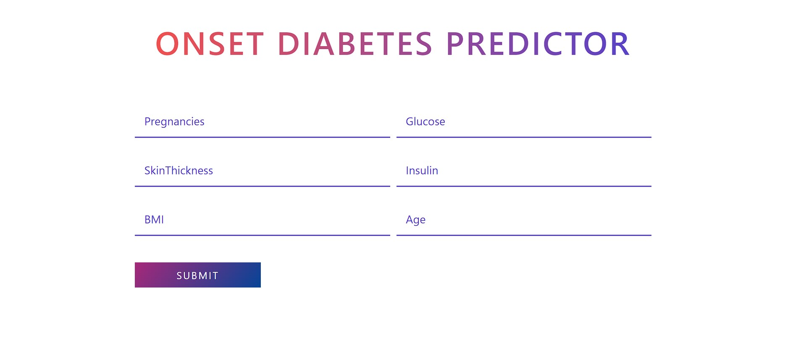

# Onset Diabetes Predictor

This repository contains the code for an Onset Diabetes Predictor application, which uses machine learning to predict the likelihood of diabetes onset based on various health metrics.

## Website

The Onset Diabetes Predictor website is hosted at: (https://diabetesprediction-o8l6.onrender.com)



## Technologies Used

- Python: Core programming language for development.
- Flask: Web framework for building the web application.
- Scikit-learn: Machine learning library for model building and evaluation.
- Pandas: Data manipulation and analysis library.
- NumPy: Library for numerical computations.
- Conda: Package and environment management system.

## How to clone the repository

1. git Clone
2. git config --global user.name ""
    git config --global user.email ""
3. git add .
4. git status   
5. git commit -m ""
6. git push origin main
Create new environment


## How to run the code
```
conda create -p venv python==3.7 -y
```

Actiavte the environment

```
conda activate venv/
```

Create requirement.txt file and install all libraries

```
pip install -r requirements.txt
```

## License

This project is licensed under the  Apache-2.0 license. See the [LICENSE](LICENSE) file for more details.

